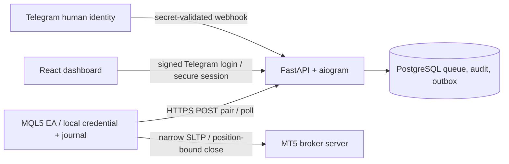

# Architecture



The user, trading account, and EA installation are independent records. Telegram's numeric ID identifies a user. An account is bound by MT5 login + exact server name. A random 256-bit secret plus public agent UUID authenticates an installation. Neither login numbers nor IP addresses authenticate agents. Credentials bind to one account and installation; the EA additionally binds its saved credentials to its terminal data directory and API origin.

The backend is one synchronous SQLAlchemy service with FastAPI handlers and two small in-process tasks: durable Telegram outbox delivery and queue expiration/retention. No broker library is installed. The React build is served by FastAPI; Compose needs only backend and PostgreSQL, plus existing/standalone Caddy at the edge.

## Durable state

`users`, `trading_accounts`, `agents`, `pairing_codes`, `symbol_mappings`, `commands`, `command_results`, and `audit_events` implement the product model. `telegram_updates` deduplicates webhooks; `telegram_outbox` separates database transactions from notification delivery; `web_sessions` holds only session-token digests; `rate_buckets` provides shared rate accounting.

A PostgreSQL partial unique index permits at most one active agent per account and another permits one PENDING, LEASED, AWAITING_CONFIRMATION, or UNCERTAIN command per account. All queue operations lock the account row. Human-driven operations use human → account lock order. PostgreSQL constraints remain a backstop if application checks race.

State path:

```text
PENDING preview → LEASED → AWAITING_CONFIRMATION
                          ├→ CANCELLED / EXPIRED
                          └→ SUCCEEDED preview + new PENDING execution
PENDING execution → LEASED → SUCCEEDED / PARTIAL / FAILED
                            └→ UNCERTAIN (blocks account)
```

A command's original 30-second deadline is never extended. Preview confirmation must arrive within that preview's original deadline; a confirmed semantic execution gets its own 30-second deadline. The EA recalculates all positions at execution time. Requests do not transmit preview ticket lists.

Leased commands can be redelivered only as the same ID before their existing deadline. They are never reassigned as fresh work. Expired undelivered work is discarded; an expired leased execution blocks the account. A late identical durable result can resolve transport uncertainty. An explicit UNCERTAIN result remains blocked until operator reconciliation; it cannot be silently replaced by a different result. Revocation/re-pairing cannot evade this block.

The EA writes a STARTED journal before invoking any broker request and stores the complete result before sending it. A restart during STARTED produces UNCERTAIN instead of rerunning the close. The server's result acknowledgement permits journal cleanup. Recent IDs stay on disk (128 entries). A local exclusive file handle prevents duplicate EAs in one terminal. There is no cross-machine hardware attestation; cloned-machine risk is documented.

Database commits cover pairing consumption, queue transitions, results, audits, webhook deduplication and notification enqueue. Result IDs and confirmation idempotency keys are unique. The outbox can repeat a notification if the process crashes after Telegram accepts it but before DB commit; callback confirmation remains idempotent. Delivery does not imply broker execution.

## Risk domain

`backend/app/domain.py` is a Decimal reference model for deterministic fixtures and the fake agent. The production decision boundary is in `mt5/Include/RiskAgent/Planner.mqh` and `Executor.mqh`. `PlanLayers` and stop validation are independently callable in MQL5 scripts; live reads are isolated in `MakePlan`/`ReadLayer`/`ReadQuote`.

BE computes requested gross side volume, subtracts already-protected volume, sorts remaining layers by entry distance from closing-side market price, and selects whole eligible tickets. Local BE buffer defaults to zero (ENTRY); positive points produce ENTRY_PLUS_POINTS. Estimated net breakeven is reserved for a later protocol version.

Close sorts by price profit per lot ascending across the selected directions. It allocates no more than requested gross volume and respects step, minimum, residual minimum and maximum deal volume. The executor independently re-reads account, ticket identifier, symbol, direction, volume, entry, SL, TP, market, and permissions. FOK/IOC filling is required; no pending remainder is allowed. Close volume is attributed to the returned broker exit deal, not merely a potentially manual change in total positions.

JSON messages are bounded to 64 KiB; at most 128 positions can participate in one plan. Unknown remote operations/fields, unsupported netting, invalid identity, stale prices, expired commands, and uncertain execution fail closed. Trade functions are unreachable from previews or from execution with the local toggle disabled.

## Scope

The user's three-command instruction overrides the master prompt's larger command menu. Inline buttons/dashboard handle account selection, exact mappings and revocation. `/close` is the specifically authorized protocol addition. It reduces gross volume but can increase net directional risk by removing a hedge leg; previews disclose BUY/SELL volume and this consequence.
